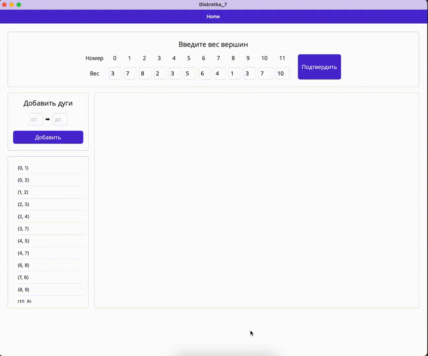

# Topological sorting

## About

Topological sort or topological ordering of a directed graph is a linear ordering of its vertices such that for every directed edge (u,v) from vertex u to vertex v, u comes before v in the ordering.
In our case, the vertexes of the graph are the tasks to be done. The weight of the vertex represent the time needed to perform the task. The application provides visualisation of the proccess.

## Output

The most efficient order of the task execution

## Video demo

